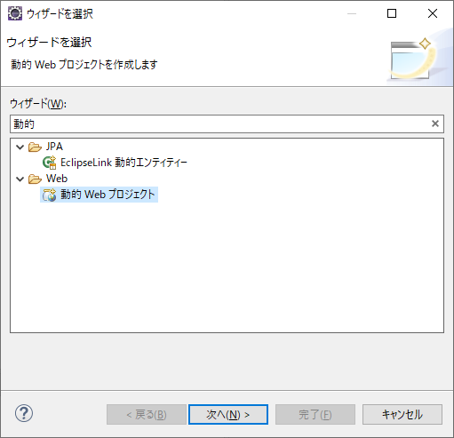

# day1 Webサービスのプロジェクトを作成して立ち上げてみよう





## 「公開」前に自動ビルドにしていない場合はプロジェクトのビルドをする


## アクセス http://localhost:8080/employee_web/EmployeeWebServlet


## doGet()を下記のように書き換えて、自動ビルドにしていない場合はプロジェクトのビルドをする
```
protected void doGet(HttpServletRequest request, HttpServletResponse response) throws ServletException, IOException {
        PrintWriter writer = null;
        try {

            //日本語の文字化け回避用に文字コードを指定
        	response.setCharacterEncoding("utf-8");
        	response.setContentType("text/html; charset=utf-8");
        	request.setCharacterEncoding("utf-8");

            //writer.write()をして画面のHTMLを書き出していく準備
            writer = response.getWriter();

            //ここからHTMLの書き始め
            writer.write("<HTML>");
            writer.write("<HEAD>");
            writer.write("  <TITLE>" + "EmployeeWebServlet" + "</TITLE>");

            //Bootstrap 4
            writer.write("  <link rel=\"stylesheet\" href=\"https://stackpath.bootstrapcdn.com/bootstrap/4.5.2/css/bootstrap.min.css\" "
                          + "integrity=\"sha384-JcKb8q3iqJ61gNV9KGb8thSsNjpSL0n8PARn9HuZOnIxN0hoP+VmmDGMN5t9UJ0Z\" crossorigin=\"anonymous\">");

            //Google Material Icons
            writer.write("  <link href=\"https://fonts.googleapis.com/icon?family=Material+Icons\" rel=\"stylesheet\">");

            writer.write("</HEAD>");
            writer.write("<BODY STYLE=\"margin-left:20px\">");
            writer.write("  <div class=\"form-row align-items-center mt-2 h2\">");
            writer.write("    <div class=\"col-auto\">");
            writer.write("      <i class=\"material-icons\" style=\"font-size: 36px;\">account_box</i>");
            writer.write("    </div>");
            writer.write("    <div class=\"col-auto\">");
            writer.write("      社員検索サービス");
            writer.write("    </div>");
            writer.write("  </div>");
            writer.write("  <div class=\"mt-2\">");
            writer.write("    <form action=\"EmployeeWebServlet\" method=\"post\">");
            writer.write("      <div class=\"form-row align-items-center mt-4\">");
            writer.write("        <div class=\"col-auto\">");
            writer.write("          <label class=\"sr-only\" for=\"search_input\">社員番号</label>");
            writer.write("          <input type=\"text\" name=\"search_input\" class=\"form-control\" placeholder=\"社員番号\" id=\"search_input\">");
            writer.write("        </div>");
            writer.write("        <div class=\"col-auto\">");
            writer.write("          <input type=\"submit\" class=\"btn btn-primary\" value=\"検索\">");
            writer.write("        </div>");
            writer.write("      </div>");
            writer.write("    </form>");
            writer.write("    <div class=\"mr-4\">");
            writer.write("      <div class=\"border p-4\">");
            writer.write("        <div class=\"text-right mb-2\">");
            writer.write("          <a class=\"btn btn-primary\" href=\"EmployeeWebServlet\">追加</a>");
            writer.write("        </div>");
            writer.write("        <table class=\"table table-striped table-bordered table-hover\" style=\"font-size:small;\">");
            writer.write("          <th>社員番号</th>");
            writer.write("          <th>名前</th>");
            writer.write("          <tr><td>1001</td><td>田中太郎</td></tr>");
            writer.write("        </table>");
            writer.write("      </div>");
            writer.write("    </div>");
            writer.write("  </div>");
            writer.write("</BODY>");

            writer.write("</HTML>");

        } catch (Exception e) {
            e.printStackTrace();
        } finally {
            writer.close();
        }
	}

```


    


最後にブラウザのデベロッパーツールから画面上の `<table>` タグを下記のサイトのものに置き変えてみてHTMLだけでカッコいいUIを実現できるbootstrapの便利さを体感しましょう！  

参考:  
https://www.tutorialrepublic.com/codelab.php?opic=bootstrap&file=crud-data-table-for-database-with-modal-form  
https://www.bootdey.com/snippets/view/Clients#html

## ひとまず検索はできないけどday1はここまで